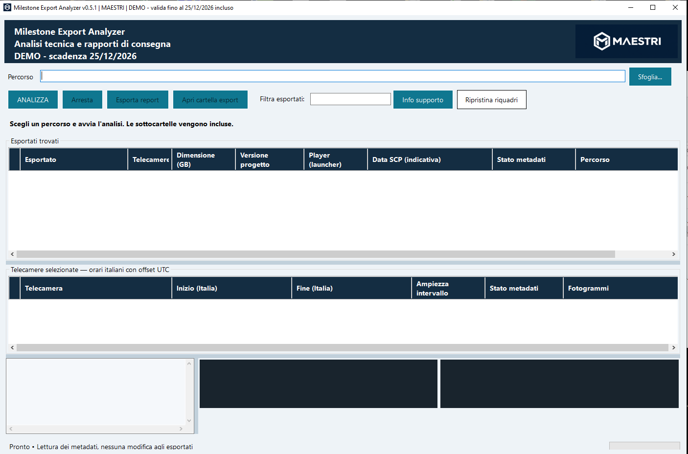

# Milestone Export Analyzer

**Controlla gli esportati Milestone e prepara i documenti da consegnare al cliente.**

Seleziona un disco USB o una cartella: il programma raccoglie le informazioni sugli esportati, mostra le telecamere e gli intervalli disponibili e prepara i report.

## Il programma

*La schermata mostra la versione 0.5.1; la 0.6.0 introduce il tema navy e la colonna di protezione password.*

## Scarica la demo 0.6.0

**[Scarica la demo per Windows](https://github.com/maestrir/Milestone-Export-Analyzer/releases/tag/v0.6.0-demo)**

Nella sezione **Assets**, scegli `MilestoneExportAnalyzer_Demo_v0.6.0.exe`. Non occorre scaricare gli archivi “Source code”.

La demo è utilizzabile fino al **25 dicembre 2026 compreso**, secondo l'orario italiano. I report già creati restano consultabili anche dopo la scadenza.

## Novità della 0.6.0

- Interfaccia navy, con intestazioni delle griglie più leggibili e filtro separato dai pulsanti.
- Protezione password indicata come **Sì**, **No** o **Non determinabile**, nella griglia e nei report.
- Per gli esportati protetti vengono letti i metadati; le anteprime vengono saltate. Non viene recuperata o decodificata alcuna password.
- Se la decodifica si interrompe, i fotogrammi già ottenuti vengono conservati.

La versione è stata provata su Windows con esito positivo il **5 ottobre 2026**.

## Cosa puoi controllare

- Esportati trovati, telecamere, intervalli di registrazione e spazio occupato.
- Nome, modello, seriale hardware e capacità del supporto: per esempio un disco da 2 TB, con il dettaglio dello spazio occupato dagli esportati.
- Versione Milestone del progetto esportato e versione del Player, quando disponibili.
- Primo e ultimo fotogramma per ogni telecamera, quando il video può essere decodificato.
- Presenza di protezione password, quando riconoscibile dai metadati dell'esportato.
- Eventuali avvisi utili al controllo tecnico.

## Due report con un solo tasto

Premendo **Esporta report**, il programma crea la cartella `REPORT_nome-supporto`. Anche i nomi dei documenti riportano il nome del supporto.

**Report tecnico completo**  
Contiene i dati dell'analisi, i percorsi, gli avvisi e i fotogrammi disponibili.

**RAPPORTO TECNICO PER CONSEGNA**  
È il documento essenziale da stampare e accompagnare al disco. Riporta i dati del supporto, le dimensioni, gli esportati, le telecamere, gli intervalli, le versioni rilevate e lo stato della protezione password. Non contiene immagini, avvisi, percorsi completi delle cartelle o data di esportazione.

Sono inclusi anche i riepiloghi CSV. I report HTML si aprono nel browser e possono essere stampati o salvati in PDF.

## Come si usa

1. Scarica e avvia l'EXE.
2. Seleziona il disco o la cartella che contiene gli esportati.
3. Avvia l'analisi e attendi il completamento.
4. Controlla i risultati e le anteprime.
5. Premi **Esporta report**.

## Requisiti

- Windows a 64 bit.
- .NET Framework **4.8 o 4.8.1**.
- Spazio libero per i componenti estratti al primo avvio e per i report.

I componenti di lettura sono inclusi nell'EXE: non è necessario installare separatamente lo Smart Client Player.

## Compatibilità e prove

Sono stati analizzati campioni di esportazione Milestone **2020 R3, 2023 R3 e 2025 R3**. La compatibilità con tutte le versioni e tutte le varianti di esportazione non è ancora verificata.

Il rilevamento password della 0.6.0 è stato verificato su quattro campioni 2020 R3 e 2023 R3: due protetti e due senza password. Se i dati sono incompleti o non concordanti, il programma indica **Non determinabile**.

La lettura video prevede H.264 e H.265; il risultato dipende dal formato dell'esportato e dal decoder. La prova su Windows ha dato esito positivo, ma non copre ogni combinazione di codec, risoluzione e sistema.

Il programma cerca progetti di esportazione Milestone con file SCP. Gli archivi ZIP vanno prima estratti. La lettura dei soli file AVI/MKV e l'inserimento di password per esportati protetti non sono previsti in questa versione.

Il seriale hardware è quello comunicato a Windows dal dispositivo o dal box USB e può non essere disponibile. Gli intervalli rilevati non attestano la continuità o l'autenticità delle registrazioni.

## Segnalazioni

Per segnalare un problema, apri una **Issue** indicando versione del programma, Windows, versione Milestone dell'esportato e messaggio di errore. Non caricare filmati o dati riservati dei clienti.

---

Progetto **MAESTRI — Roberto Maestri**. Software indipendente, non ufficiale Milestone. Questo repository contiene documentazione e demo; il codice sorgente dell'applicazione non è pubblicato.
